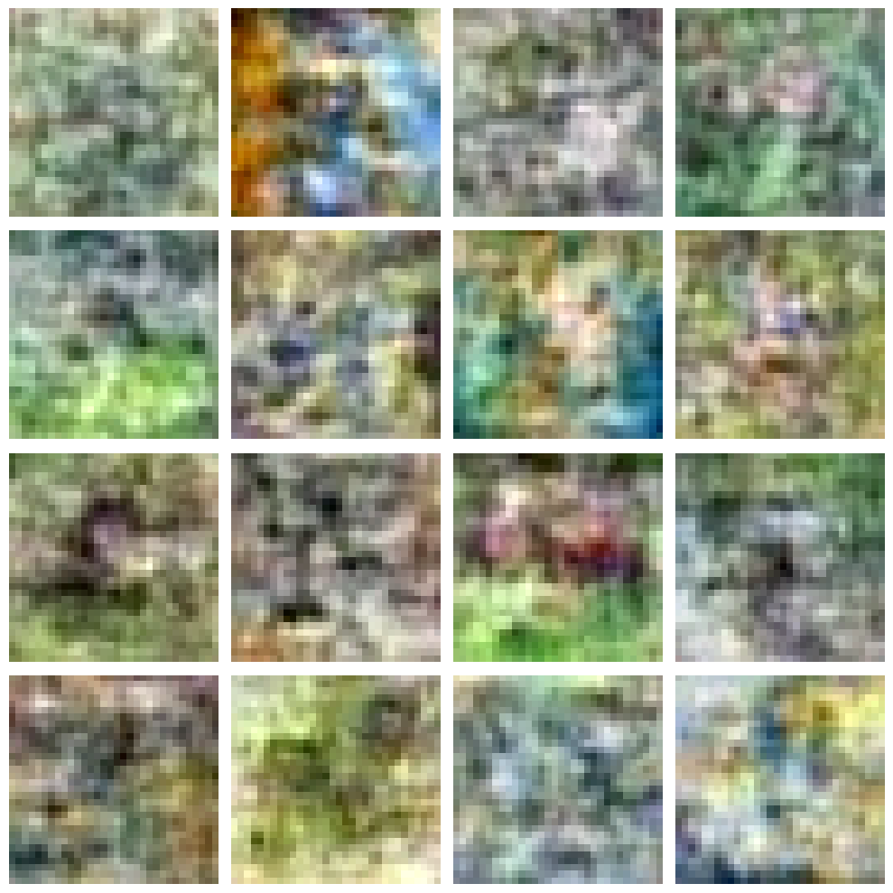
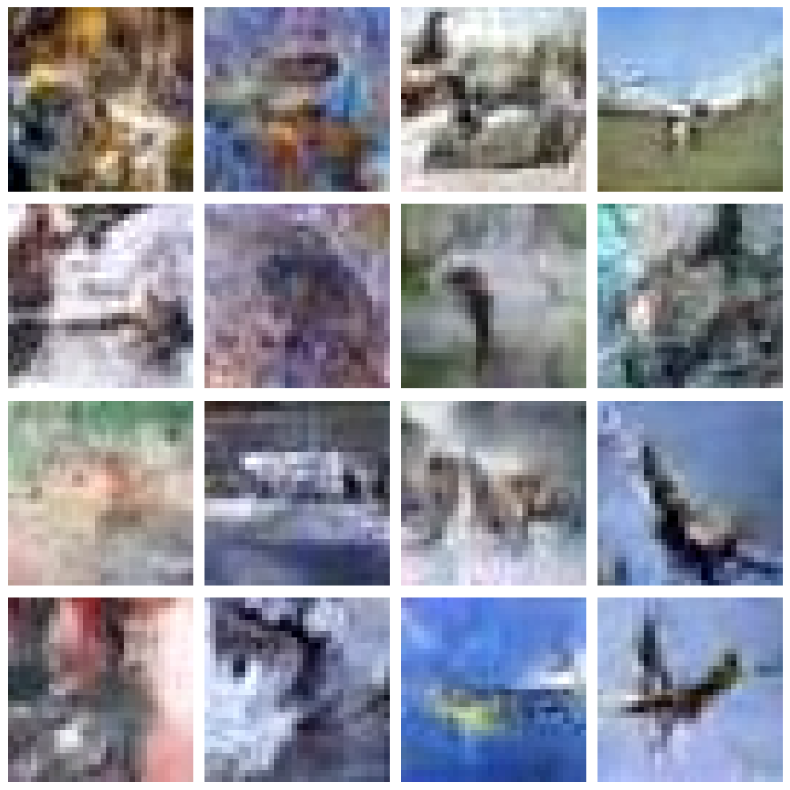

# DDPM-CIFAR
Training a Denoising Diffusion Probabilistic Model (DDPM) on CIFAR-10 using Jupyter Notebook in Google Colab.

## Results 

### Configuration Details

| Configuration | Epochs | Batch Size | Learning Rate | Training Time           | Model Size |
|:--------------|:-------:|:-----------:|:--------------:|:------------------------:|:----------:|
| **1**        | 200     | 128         | 1e-4           | Approximately 20 minutes | 5.5 GB     |
| **2**        | 400     | 128         | 1e-3           | Approximately 1 hour 46 minutes | 5.5 GB     |

### Configuration 1 & 2

Below are the generated samples for each configuration:

<table>
  <tr>
    <td>
      
    </td>
    <td>
      
    </td>
  </tr>
</table>

## 🙏 Acknowledgments

- [CIFAR-10 dataset](https://www.cs.toronto.edu/~kriz/cifar.html)
- [Original DDPM paper](https://arxiv.org/abs/2006.11239)
- [DiffusionFastForward](https://github.com/mikonvergence/DiffusionFastForward): A free course and experimental framework for diffusion-based generative models, which provided valuable insights and the model architecture that CIFAR-10 was trained on.